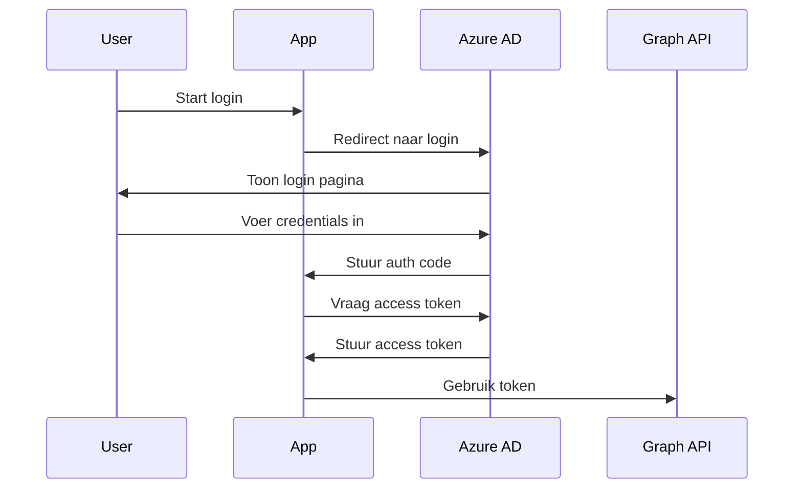
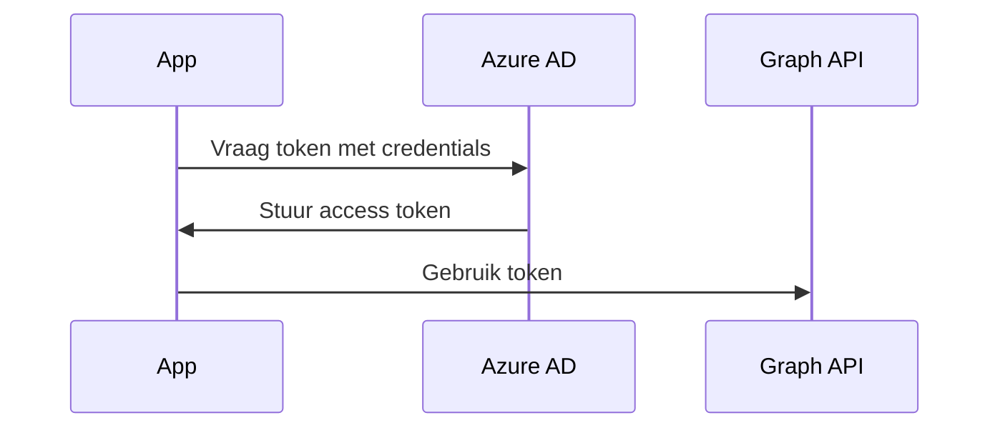

# Authenticatie en Autorisatie in Microsoft Graph

In deze les gaan we dieper in op hoe je jezelf identificeert (authenticatie) en welke rechten je hebt (autorisatie) wanneer je met Microsoft Graph werkt.

## Azure AD Basis

Azure Active Directory (Azure AD) is het hart van authenticatie en autorisatie voor Microsoft Graph. Het is als een digitale identiteitskaart:
- Het beheert wie je bent (authenticatie)
- Het bepaalt wat je mag doen (autorisatie)

### Belangrijke Azure AD Concepten

1. **Tenant**
   - Je organisatie's eigen Azure AD omgeving
   - Unieke identificatie (bijvoorbeeld: contoso.onmicrosoft.com)
   - Bevat alle gebruikers, groepen en apps

2. **App Registratie**
   - Een registratie van je applicatie in Azure AD
   - Geeft je app een identiteit
   - Beheert toegangsrechten

3. **Service Principal**
   - De lokale vertegenwoordiging van je app in je tenant
   - Wordt automatisch aangemaakt bij app registratie
   - Beheert de relatie tussen app en tenant

## App Registratie Maken

Laten we stap voor stap een app registratie maken:

1. **Ga naar Azure Portal**
   ```powershell
   # Open Azure Portal
   Start-Process "https://portal.azure.com"
   ```

2. **Navigeer naar App Registraties**
   - Zoek naar "App registraties"
   - Klik op "Nieuwe registratie"

3. **Vul de basis informatie in**
   - Naam: "MSGraph Cursus App"
   - Ondersteunde accounttypen: "Accounts in deze organisatiemap"
   - Redirect URI: "http://localhost"

4. **Registreer de app**
   - Klik op "Registreren"
   - Noteer de "Application (client) ID"
   - Noteer de "Directory (tenant) ID"

## Permissions en Scopes

### Wat zijn Permissions?

Permissions zijn als een pasje met verschillende toegangsniveaus:
- **Delegated Permissions**: Voor gebruikers die ingelogd zijn
- **Application Permissions**: Voor apps die zelfstandig werken

### Belangrijke Permissions

```plaintext
User.Read              - Gebruikersinformatie lezen
User.ReadWrite.All     - Gebruikers beheren
Group.Read.All         - Groepen bekijken
Group.ReadWrite.All    - Groepen beheren
Device.Read.All        - Apparaten bekijken
```

### Permissions Toevoegen

1. Ga naar je app registratie
2. Klik op "API permissions"
3. Klik op "Add a permission"
4. Kies "Microsoft Graph"
5. Selecteer de gewenste permissions

## OAuth 2.0 Flow

OAuth 2.0 is het protocol dat Microsoft Graph gebruikt voor authenticatie. Er zijn verschillende flows:

### 1. Authorization Code Flow


### 2. Client Credentials Flow


## Praktische Implementatie

### PowerShell Voorbeeld

```powershell
# Verbinding maken met Microsoft Graph
Connect-MgGraph -Scopes "User.Read", "Group.Read.All"

# Token ophalen
$token = Get-MgContext | Select-Object -ExpandProperty AccessToken

# Token gebruiken voor API calls
$headers = @{
    'Authorization' = "Bearer $token"
}
```

### Python Voorbeeld

```python
from msgraph.core import GraphClient
from azure.identity import ClientSecretCredential

def get_graph_client():
    # Credentials configureren
    tenant_id = "YOUR_TENANT_ID"
    client_id = "YOUR_CLIENT_ID"
    client_secret = "YOUR_CLIENT_SECRET"
    
    # Credentials object maken
    credentials = ClientSecretCredential(
        tenant_id=tenant_id,
        client_id=client_id,
        client_secret=client_secret
    )
    
    # Graph client maken
    return GraphClient(credentials=credentials)
```

## Best Practices

1. **Veilige Credential Opslag**
   - Gebruik environment variables
   - Gebruik Azure Key Vault
   - Nooit hardcoded in scripts

2. **Minimale Permissions**
   - Vraag alleen de permissions die je nodig hebt
   - Review permissions regelmatig
   - Gebruik least privilege principe

3. **Token Management**
   - Implementeer token refresh
   - Check token geldigheid
   - Log authentication events

## Volgende Stap

Nu je begrijpt hoe authenticatie en autorisatie werken, gaan we in de volgende les kijken naar [eerste stappen met PowerShell](01_03_powershell_basics.md). Daar gaan we deze kennis in praktijk brengen. 